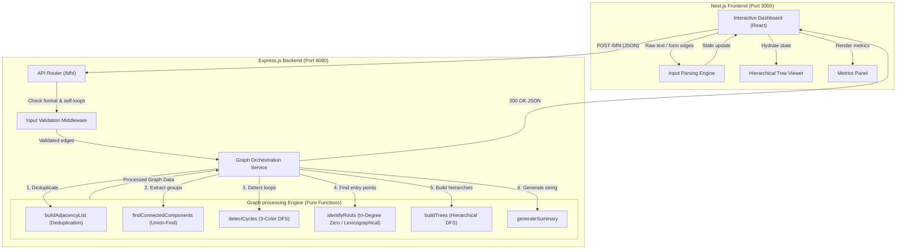

# 🌳 BFHL Graph Processing System & Dashboard
### Chitkara Full Stack Engineering Challenge

A production-grade, full-stack application designed to parse, deduplicate, validate, and analyze directed graphs. The system decomposes complex directed graphs into their constituent connected components, detects cyclic loops, selects appropriate component roots, and builds tree hierarchies returned as structured JSON.

---

## 🏛️ System Architecture

The project is split into a **Next.js Single Page Application (SPA)** and a **Node.js/Express.js REST API**, utilizing clean, decoupled architecture:



---

## ⚡ How the Graph Processing Engine Works

The core of the application lies in `src/utils/graphUtils.js`. It executes 7 major phases sequentially:

### 1. Adjacency List Construction & Deduplication
- **Method:** `buildAdjacencyList(edges)`
- **Behavior:** Receives raw coordinate arrays `[from, to]` and filters duplicates (e.g. if `A -> B` is submitted twice, it's processed once). Self-loops are caught at the validator middleware layer prior to this step.

### 2. Connected Component Grouping (Union-Find)
- **Method:** `findConnectedComponents(nodes, edges)`
- **Behavior:** Operates on an *undirected* view of the graph using a Union-Find (Disjoint-Set) data structure with path compression. This partitions the graph into independent disconnected subgraphs (components) so they can be structured into trees separately.

### 3. Loop and Cycle Detection (3-Color DFS)
- **Method:** `detectCycles(adjList)`
- **Behavior:** Uses a depth-first search with 3-state coloring to detect back-edges:
  - `WHITE (0)`: Unvisited node.
  - `GRAY (1)`: Under active recursion stack. Encountering a gray node indicates a back-edge (cycle).
  - `BLACK (2)`: Visited and exited.
  This prevents false-positive cycle reports on cross-edges (such as in Diamond configurations).

### 4. Root Identification
- **Method:** `identifyRoots(nodes, inDegrees)`
- **Behavior:**
  - Nodes with an in-degree of `0` are selected as roots.
  - If a component is a **pure cycle** (e.g., `A -> B -> C -> A`), no node has an in-degree of `0`. In this case, the engine automatically selects the **lexicographically smallest node** (alphabetically first) to act as the tree root.

### 5. Tree Hierarchy Reconstruction
- **Method:** `buildTree(node, adj, visited, componentNodes)`
- **Behavior:** Performs a DFS traversal from each selected root. If a node points to a child that has already been visited *within the current component recursion*, it marks that relationship with a `cycleBackRef` property instead of recursing further, preventing infinite loops.

---

## 🛠️ API Reference

The backend exposes a single, high-performance endpoint at `/bfhl` supporting CORS.

### 1. Process Graph Configuration
- **Route:** `/bfhl`
- **Method:** `POST`
- **Headers:** `Content-Type: application/json`
- **Request Body:**
```json
{
  "data": [
    "A->B", "A->C", "B->D", "C->E", "E->F",
    "X->Y", "Y->Z", "Z->X",
    "P->Q", "Q->R",
    "G->H", "G->H", "G->I",
    "hello", "1->2", "A->"
  ]
}
```
- **Response (200 OK):**
```json
{
  "user_id": "naman_kumar_1212",
  "email_id": "naman@example.com",
  "college_roll_number": "123456",
  "hierarchies": [
    {
      "root": "A",
      "tree": {
        "A": {
          "B": { "D": {} },
          "C": { "E": { "F": {} } }
        }
      },
      "depth": 4
    },
    {
      "root": "X",
      "tree": {},
      "has_cycle": true
    },
    {
      "root": "P",
      "tree": {
        "P": { "Q": { "R": {} } }
      },
      "depth": 3
    },
    {
      "root": "G",
      "tree": {
        "G": { "H": {}, "I": {} }
      },
      "depth": 2
    }
  ],
  "invalid_entries": [
    "hello",
    "1->2",
    "A->"
  ],
  "duplicate_edges": [
    "G->H"
  ],
  "summary": {
    "total_trees": 3,
    "total_cycles": 1,
    "largest_tree_root": "A"
  }
}
```

### 2. Operational Info
- **Route:** `/bfhl`
- **Method:** `GET`
- **Response (200 OK):**
```json
{
  "success": true,
  "operation_code": 1
}
```

---

## 🎨 Frontend Features & Working

The frontend app is a single-page dashboard built using Next.js, featuring:
1. **Industrial Utilitarian Design:** A stark, high-contrast monochrome aesthetic utilizing monospace typography, 1px structural borders, and Deep Blacks/Stark White accents.
2. **Kinetic Motion Engine:** Deep integration of Anime.js for complex, staggered, physics-based (spring) animations across page loads and component mounting.
3. **Interactive Form Input:** Add individual edge pairs (`from` and `to` inputs) with validation.
4. **Raw Text Area Input:** Paste raw lists of edges in various formats (`A->B`).
5. **Live Stats Dashboard:** Displays metrics such as total valid trees, duplicate edges, and invalid entries.
6. **Recursive Tree Viewer:** Interactive JSON tree rendering to visualize hierarchies natively.

---

## 🚀 How to Run Locally

### Prerequisites
- Node.js (v18+)
- npm (v9+)

### 1. Backend Server Setup
1. Go to the project root.
2. Setup environment variables:
   ```bash
   cp .env.example .env
   ```
3. Install dependencies and start development server:
   ```bash
   npm install
   npm run dev
   ```
   The API will start on `http://localhost:8080`.

### 2. Frontend App Setup
1. Go to the `/frontend` directory.
2. Create your environment config file `.env.local`:
   ```env
   NEXT_PUBLIC_API_URL=http://localhost:8080
   ```
3. Install dependencies and start server:
   ```bash
   npm install
   npm run dev
   ```
   The client dashboard will run on `http://localhost:3000`.

### 3. Running Tests
Run the Jest test suite from the project root:
```bash
npm test
```
This runs 34 test cases verifying all validation layers, API responses, cycle detection limits, and edge cases.
